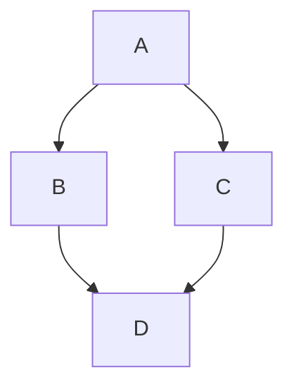

## GoAT

https://gohugo.io/content-management/diagrams/#goat-diagrams-ascii

## Mermaid

https://gohugo.io/content-management/diagrams/#mermaid-diagrams

````md

```mermaid
graph TD;
    A-->B;
    A-->C;
    B-->D;
    C-->D;
```
````


```mermaid
graph TD;
    A-->B;
    A-->C;
    B-->D;
    C-->D;
```
